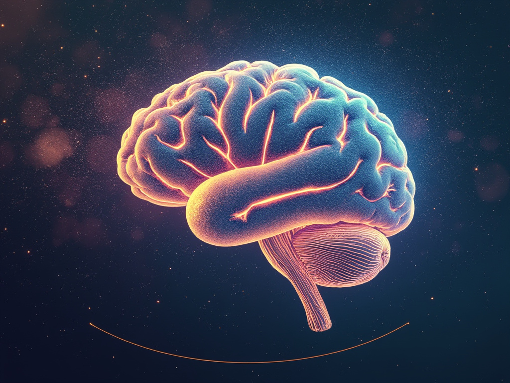
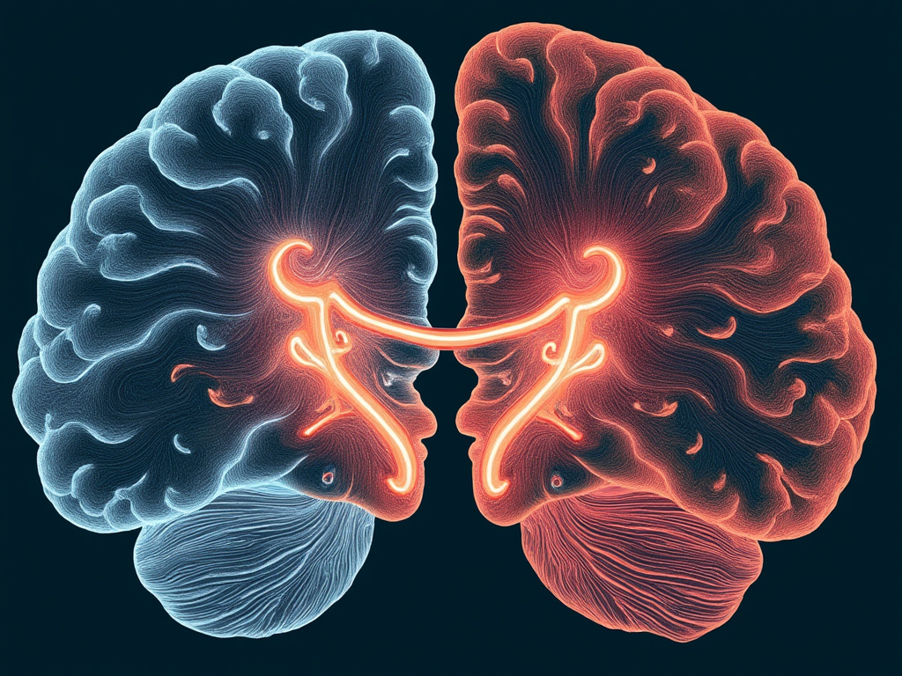

# Are We In Base Level Reality?
[Home](../../index.md)

The concept of parallel realities has long intrigued humanity. My first encounter with this notion was through my parents, who shared their understanding of reality based on the Bible. They described heaven as a place where souls go after death, with our current existence serving as a test of worthiness for entry. While their explanation had more nuances, that was its essence. You’re likely familiar with the Christian narrative of Genesis—the account of how our reality came into being.

As I explored different perspectives and gained more knowledge, I realized there was much more to uncover. The Genesis story left many questions unanswered and seemed to contradict established scientific facts. For me, the nature of our reality remains an intriguing and unresolved mystery.

To entertain the idea that we may not inhabit the "base-level" reality, it's essential to understand how different layers of reality can coexist. Dreams provide a straightforward example. When we dream, our minds construct a world that feels vivid and real, complete with its own rules—time may flow differently, physical laws might not apply, and events often defy logic. Yet these dream worlds exist entirely within the framework of our waking reality, dependent on our brains for their creation.

In this analogy, our waking reality serves as the "higher layer," providing the physical and mental structures that generate the dream. The dream layer is self-contained and coherent while it lasts but cannot exist without the underlying waking layer. This illustrates how a dependent reality can emerge, function, and feel real within a foundational one.

For the dreamer, the dream feels authentic—emotions are genuine, decisions are made, and experiences are processed. These effects can carry over into waking life, influencing thoughts and feelings. Dreams are full of illusions, yet these do not render the dream a "fake" reality. For instance, experiencing the death of a loved one in a dream can evoke profound emotions—grief, loss, even relief. While the loved one remains alive in our waking world, the emotions felt in the dream are authentic. The loved one in the dream is a construct of the mind, much like other characters who behave as non-playable characters (NPCs) without independent consciousness. Thus, the dream layer is not "fake" but a valid, albeit transient, realm within our consciousness.

Now, imagine a hypothetical scenario where two people could enter the same dream simultaneously. In this shared dream world, they would experience genuine interactions and meaningful experiences. If they fell in love within the dream, their emotions would be real. The presence of two conscious individuals creates a shared reality within the dream layer, blurring the line between illusion and reality.

Pushing this idea further, the complexity of a shared dream environment could potentially give rise to new forms of consciousness within the dream itself. Just as our minds generate complex characters in individual dreams, the combined cognitive processes of multiple dreamers might lead to entities exhibiting independent behavior and awareness.

Consider the split-brain experiments conducted to treat severe epilepsy, where the corpus callosum—the part of the brain that connects the two hemispheres—was severed. These experiments revealed that separate streams of consciousness could exist within the same brain. One hemisphere could respond to a stimulus without the other being aware, demonstrating two distinct centers of awareness within a single individual.

Further evidence comes from Dissociative Identity Disorder (DID), where individuals exhibit multiple distinct personalities, each with its own name, gender, and memories. These personalities can alternate in control of the body and may not share awareness of each other, supporting the idea that multiple consciousnesses can coexist within the same physical substrate.

If one of the dreamers in a shared dream environment had undergone split-brain surgery, it's conceivable that their two hemispheres could manifest as separate entities within the dream world. In essence, the dream could provide separate "bodies" or avatars for each hemisphere, allowing them to operate independently within the next layer of reality. This thought experiment underscores the possibility that multiple consciousnesses can be created and sustained on the same substrate, whether that substrate is a human brain, a shared dream layer, or an advanced computational system.

It's conceivable that certain forms of consciousness might exist solely within the dream layer, making it their primary reality. For these beings, the dream world would be as real as our waking world is to us. This suggests that a dream layer, while dependent on another reality for its existence, could serve as a fully-fledged layer of reality, complete with meaningful experiences and conscious beings. Everything happening in the dream would be connected to changes in the higher layer—the brain, which acts as the substrate for this next layer of reality.

While our brains have limitations, we're likely to create much more powerful computers in the future, within which a reality could exist. It's hard to overstate how much more powerful such computers could become compared to our brains. With fewer physical constraints on memory, data storage, and information processing abilities, these computers could provide a substrate for a much more complex reality and complex conscious entities than what our brains create in dreams.

Some might argue that if conscious beings existed in such a reality, they wouldn't be "real." However, this reaction is mistaken. Reality is defined by experience, and what we experience is all that matters. What could matter that is not experienced by any consciousness ever? The answer is nothing. It doesn't matter if the experience is on the base layer or five hundred layers deep; each experience is equally meaningful and real.

Our reality appears to be "pixelated" and bound by a universal speed limit, concepts rooted in hard science. The smallest unit of measurement, the Planck length (1.6×10^−35 meters), shows that space and time are not infinitely smooth but quantized, like pixels in a digital image. Similarly, the speed of light—about 299,792 kilometers per second—serves as an unbreakable limit, beyond which nothing can travel.

These discoveries reveal that the universe operates on a structured, rule-based framework, with space as a quantized "grid" and light's speed shaping interactions. This suggests a deeper, underlying structure to our reality, governed by fundamental laws.

When I consider that there's no conceptual limit to how many layers of reality can be stacked, and that our own reality appears to be pixelated and bound by a universal speed limit, I can't help but wonder: Are we truly living in base-level reality? Could our existence be akin to a split-brain patient, with separate streams of consciousness interacting within a dream one layer down? And if so, is it possible that all of us are fragments of the same greater mind, collectively experiencing this shared reality?

