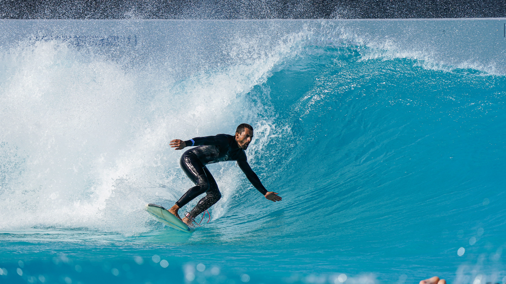

# Confidence
[Home](../../index.md)

Confidence is an important and consequential feeling. It’s consequential because it plays such a huge role in affecting my decision’s, my actions, and it bleeds into other feelings.

When I first started surfing I had a lot of trouble feeling confident in my decisions. I’d make a decision to paddle for a wave, but I wasn’t confident in my decision, so I’d half paddle for the wave. I knew the consequences were bad if it went wrong. Sometimes I would paddle for the wrong wave, only to catch some choppy whitewater and be pushed back to the shore. The paddle back was a long, tiring and painful battle. Other times I’d paddle for a wave, only to be sucked up by my feet, dumped, then held underwater while being thrashed around. It was going wrong so often, that I accepted the fact that it would probably keep going wrong. When I accepted that, I figured I might as well paddle hard when going to catch a wave. I started doing that and I had a breakthrough. I realised that my lack of confidence in my decision to go for a wave was actually affecting the outcome of me catching it. I learnt to analyse the situation with the little time I had, make a decision, feel confident that I had made the right decision with the time and information I had, then go for it with EVERYTHING I had. I caught more waves and had much better rides after I found that confidence.

I still try for waves that don’t go right. I can’t ever be 100% confident in the outcome. But it’s like that with every decision we make right? To some degree everything is a gamble because every outcome in the future is NEVER guaranteed. There are simply no guarantees in life. Now I anylse the situation, make a decision, feel confident in my decision and go ‘all in’ behind my decision. If it goes wrong it doesn't neccesarily mean I made the wrong call to give it a shot. That way of doing it simply reduces the chances of getting hurt and maximises the chances of success. I don’t think it can be applied to everything, but it can be applied to quite a lot of situations.

Overconfidence is the flip side of the coin. I’ve definitely experienced that. But not really in the realm of committing to decisions. I’ve been over confident in beliefs based on ‘gut feelings’. I’ve come to learn that my ‘gut feel’ is actually something going on in my brain, and it’s mostly generated by the more primitive part. I suppose it has something to do with when we need to make decisions really quickly and don't have the time to consciously think it all through. The more I learn, the more examples I find of illusions embedded in reality, that generate a ‘gut feel’ confidence in the illusion. For example the [placebo effect](https://en.wikipedia.org/wiki/Placebo), which is why we need to do [double blind randomised placebo controlled trials](https://en.wikipedia.org/wiki/Randomized_controlled_trial) to figure out if medications actually work. It would be nice to outsource the responsibility of 'feeling confident' to my 'gut feel', but I've experienced to much to believe that reality works like that. However, at the end of the day, I think that *how* conscious lifeforms *feel*, is the only thing that matters, so gut feel is far from meaningless. If I’ve got the time, I think through my gut feelings. If they make sense, I roll with them. If they don’t, they get labelled faulty, and usually the feeling catches up and aligns with the label.

Sometimes I think through a belief and I can’t be confident in any conclusion. It’s not true or false, it’s not black and white. For example, it could be the belief that a particular food, supplement, or vaccine, is good for me. It’s those times where I kind of assign a confidence level, somewhere between 0 and 100 percent to my belief. I don’t actually come up with numbers as I go through my day, but I’ve noticed that my mind basically allocates a confidence level to my belief. I can feel it calculating away as I try and understand reality. My 'confidence level' is then taken into account when I make a decision.

The best type of confidence is when I have a good gut feel, I’ve thought it all through, and it all checks out. Those situations don’t come around often, but sometimes there are 6ft swells, with waves 15 seconds apart and a light offshore wind. I’m apparently in the perfect position at the perfect time. It takes a second for me to believe that it’s not 'too good to be true'. I quickly let go of the "too good to be true" type of doubt. I know that I’d be totally mad *not* to take on this gamble, and go for the incedible wave with everything I’ve got. I start getting to my feet. I'm confident; I'm not scared that I'll fuck it up. I'm being playful, in a dance that constantly changes and adjusts as it plays out. It feels good, it feels right.

[Home](../../index.md)
