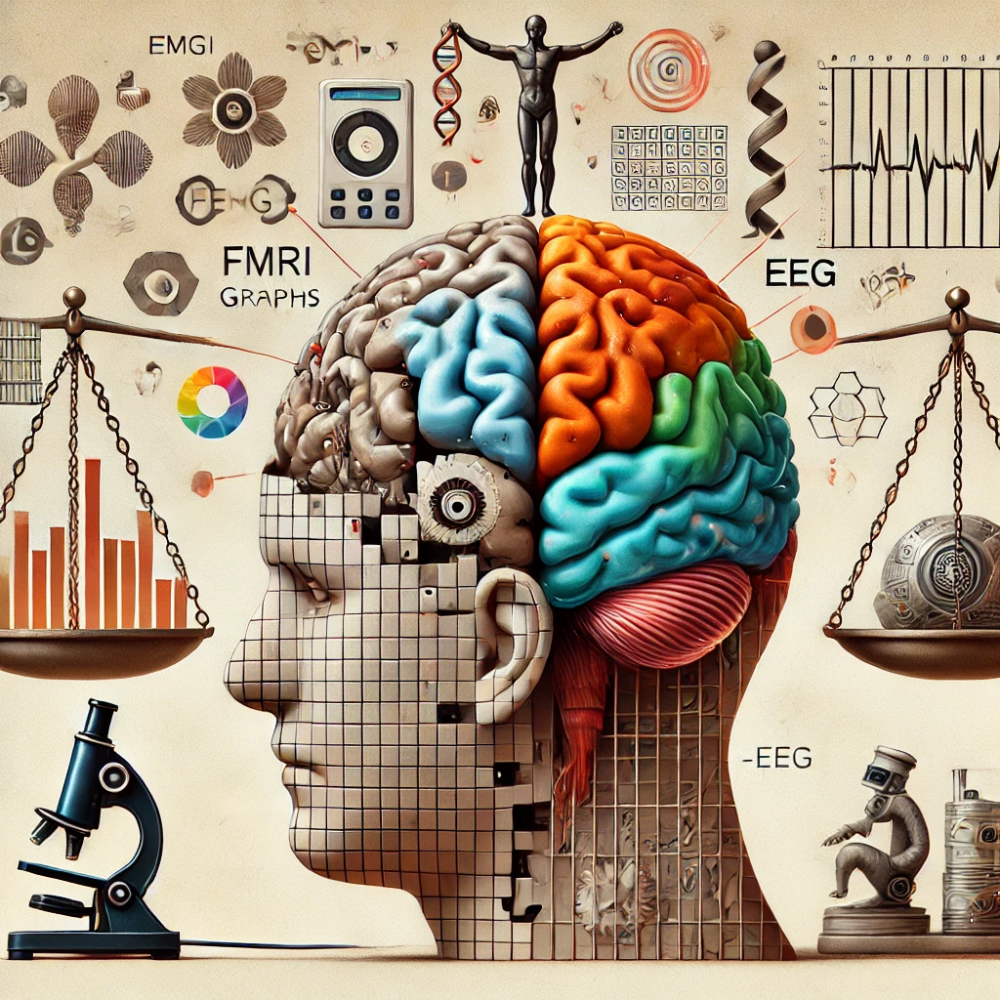
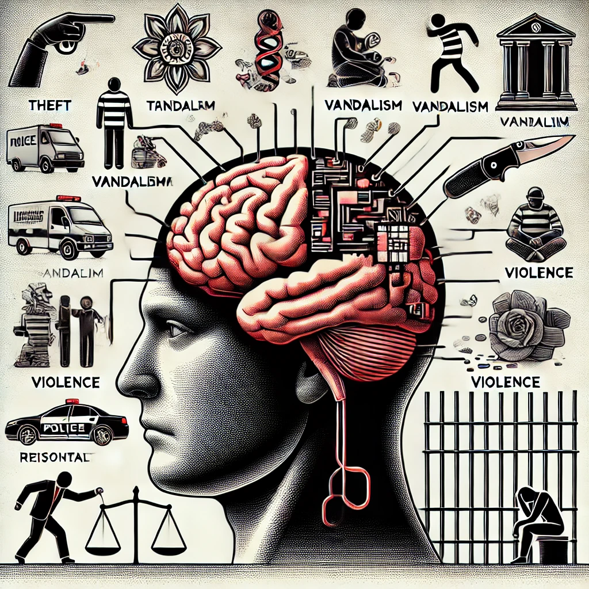

# Malfunctioning Minds
[Home](../../index.md)

For some time, I have held the belief that the greatest advancement for human well-being would be to recognize and correct malfunctioning minds.

I refer to a state where the mind doesn't work properly or as intended. In the physical realm, malfunctions are caused by defects in design, construction, wear and tear, improper use, or external factors. The severity of these malfunctions can range from minor inconveniences to serious issues. Think of how your car malfunctions, for example.

You might think that 'malfunctioning' can't possibly apply to the mind because it’s typically used for physical systems. However, I believe our minds do function as physical systems. Specifically, our brains are the physical systems responsible for our thoughts, feelings, and decisions. Although I am ignoring other parts of the central nervous system for simplicity, the point remains the same: our brains are physical systems that generate our mental experiences. The fact that our thoughts, feelings, and decisions can be traced back to a physical system is a fundamental premise of my argument. This assertion is nothing new; it is standard scientific knowledge, and I haven't found any debate in the scientific community to the contrary. Neuroscientists have used various techniques such as fMRI, EEG, and PET scans to study how specific thoughts, feelings, and emotions correspond to neural activity in the brain. While there is still much to learn about how it works, the link between the brain and experience is undeniable.

What is a mind that is working properly? I have some thoughts about this:
No one has an objective and comprehensive definition of what a properly functioning mind should think, feel, or decide.
At times, we can very clearly identify when a person is not thinking, feeling, or deciding clearly. An example would be the man who tragically threw his child off the West Gate Bridge.
We can also identify when a person is thinking, feeling, or deciding in a way that is not malfunctioning. An example would be Albert Einstein conducting his thought experiments to develop General and Special Relativity.
We do not need to perfectly understand the grey area between malfunctioning and not malfunctioning to recognize that the concept of a malfunctioning mind exists.

Considering that all our actions can be traced back to our minds, and our minds are physical systems, the logical conclusion is that every malfunctioning action originates from a malfunctioning mind.

A conclusion of this reality is that almost all crime is a consequence of the mind malfunctioning. This seems to be an uncomfortable reality for many to digest. People often seek 'justice' and desire punishment for others' choices. Some view crimes, such as theft, as acts of desperation. A friend once asked me, "What about the guy who steals a loaf of bread to feed his starving family?" I replied, "Identifying that particular situation as a crime would be a misidentification. Moreover, I doubt anyone in all of Australia is stealing a loaf of bread to prevent people from dying of starvation in 2024."

If you agree with my premises, then my final conclusion is the only logical one. It’s obvious when you think about it. Why would anyone take massive amounts of meth if they felt perfectly fine without it? Why would anyone hurt another person (physically, through stealing, or otherwise) if they felt perfectly fine being kind? The feelings that drive these malfunctions are simply the result of a malfunctioning physical system. This physical system is shaped by our inherited genetic code and our environment. Fundamentally, my position is that it is both 'nature and nurture' that make us who we are.

It seems to me that our systems are not designed on the premise that malfunctioning minds are the root cause of malfunctioning people. In fact, [mental impairment is a sentencing factor](https://www.sentencingcouncil.vic.gov.au/about-sentencing/mental-impairment-and-sentencing). As a sentencing factor, mental impairment can “reduce the offender's moral culpability” and “justify a less severe sentence.” I have some issues with that. Since all actions can be traced back to a malfunctioning physical system, it is evident that all criminals are mentally impaired. There is no difference in moral culpability.

[Charles Whitman’s mass murder](https://en.wikipedia.org/wiki/Charles_Whitman) was found to be influenced by a tumor in his brain. Another individual committing the same crime could have been brutally beaten as a child. Yet another may have had a seemingly perfect childhood with no brain tumors, appearing generally normal. We tend to consider this third person more morally culpable, but the reality is that we currently lack the ability to see the brain with enough resolution to pinpoint the malfunction that caused the action. Physical structures, such as neuron configurations or smaller molecular structures, cause the brain to malfunction and produce these actions. Although we don’t have the imaging technology today to see them with enough resolution, that doesn’t mean those neural structures don’t exist. There is ample evidence to conclude that the physical structure of the brain influences our actions.

On the topic of mental impairment being used to “justify a less severe sentence,” our ability to pinpoint mental impairment should not determine if someone is mentally impaired. Let’s say you push the brake pedal in your car, and the car doesn’t slow down. Your mechanic can’t pinpoint why your car isn’t slowing down when you hit the brakes. Does that mean your brakes are fine? No! And so it goes with the mind. We know the brain is immensely more complicated than a car, and we know that ‘brain mechanics’ (e.g., doctors, neurosurgeons, psychiatrists, and psychologists) are only just beginning to figure out how to fix things. Metaphorically speaking, the focus should really be on whether ‘the brakes work or not.’ By justifying a less severe sentence for those who are mentally impaired, we are essentially deeming a car as having safer brakes just because we can pinpoint why they are not working. The brakes are malfunctioning in both cases; what matters is the fact that they are unsafe.

Our system sometimes labels people as ‘mentally unfit.’ As [four corners](https://youtu.be/976Hz3hUfIM?feature=shared) put it, “People with an intellectual disability or serious mental illness are being locked away out of sight.” They are “charged but never convicted.” My issue is not with the fact that we lock up dangerous people; it’s that we only treat some people as if their minds are malfunctioning. I believe they all are, and what we do with those people should be related to the safety of everyone.

Currently, our criminal rehabilitation system seems to pretend that it knows how to rehabilitate people’s minds, or, continuing with my analogy, fix the brakes. The reality is, we have little to no idea of how to pinpoint the issues with the mind and fix them. It is as if we park a car with malfunctioning brakes at the mechanic for a while and expect it to be safe after simply parking it there. The mechanic in this analogy is the prison or ‘rehabilitation center.’ In some cases, it would be fair to say that we take the car to the mechanic, the mechanic hits it with a hammer, and we then hope the brakes work better after that.

It appears to me that there is a general lack of honesty in assessing the current situation. Many people I talk to see drug abuse and other forms of self-sabotage as a “choice” rather than the consequence of a malfunctioning mind. As far as I can tell, this perspective stems from a deep discomfort with the randomness and “unfairness” of reality. The need for accountability in society is deeply felt. However, feelings do not aid in the analysis of reality. The emotional triggers that may be set off when using words like “malfunction” in the context of a human don’t help with the analysis of humans. Nor do feelings assist in generating possible solutions and improvements. We have a bias toward believing the universe works as we want it to. Therefore, removing our feelings from the analysis of the situation is the first step in improving it, assuming that one first feels that improvement is desired.

I am confident that our current tools for fixing brains can be improved. As a society, I think it's very important that we recognize that scientific advancement in brain-fixing tools is extremely important for human well-being, preventing antisocial behavior and clear thinking.

[Home](../../index.md)