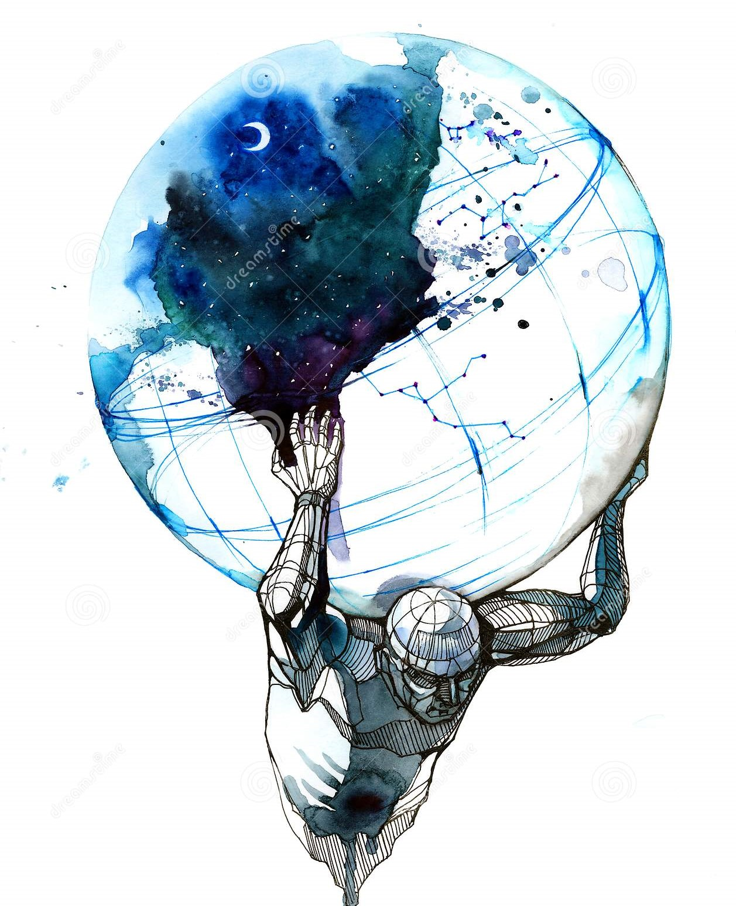

# Musings on Responsibility

[Home](../../index.md)

Responsibility is an interesting thing to think about. I think it’s quite complicated. When I was a high school teacher there were times I felt the weight of it bearing down on me. For example during excursions where it was my responsibility to supervise the students. I found it very difficult to keep them most of them within my field of vision, and hence reasonably supervise them. It was an almost impossible task that put pressure on me. It was a relief when I could let that responsibility go at the end of the day.

I guess we can only be responsible for what we can control. When thinking about this the next natural question was; ‘what can I control?’. I realised that my actions can only affect the probabilities of outcomes. There are some things where my actions pretty much guarantee outcomes, and there are some things that I could put a whole bunch of effort into and have basically zero impact on the outcome.

I believe my number one priority is my own wellbeing. I would have once considered that simply selfish, but I now consider it selfless and selfish. I think this for a few reasons; I realised that: 
- the person that has the greatest level of control of my wellbeing is myself;
- I am useless to others (or worse) if my own wellbeing is in trouble;
- as a whole, humanity’s wellbeing is best optimised if people take care of themselves first, and then branch out to others.

I try to take care of my health. Of course this is a probabilistic thing. For example, what we put in our bodies, and how we move our bodies changes the probability that we will get cancer, but it doesn’t guarantee an outcome either way. This is a pretty frustrating reality if you ask me. Sometimes when I speak to people I get the impression that they feel it makes sense to let go of the responsibility of things they can’t control to the point of having a guarantee. I don't believe that makes sense. I think it’s my responsibility to put the odds in my favor. For my sake, and for everyone around me. Of course, I’m *FAR* from perfect, and I don’t always do that. At 34 I’m still improving, I like improving.

When it comes to taking on more responsibility, I see improving similar to weight lifting; start with a lower weight, practise, keep increasing the weight in small increments. With practise and small increments, maybe one day I’ll be able to handle weights that would break me today.

[Home](../../index.md)