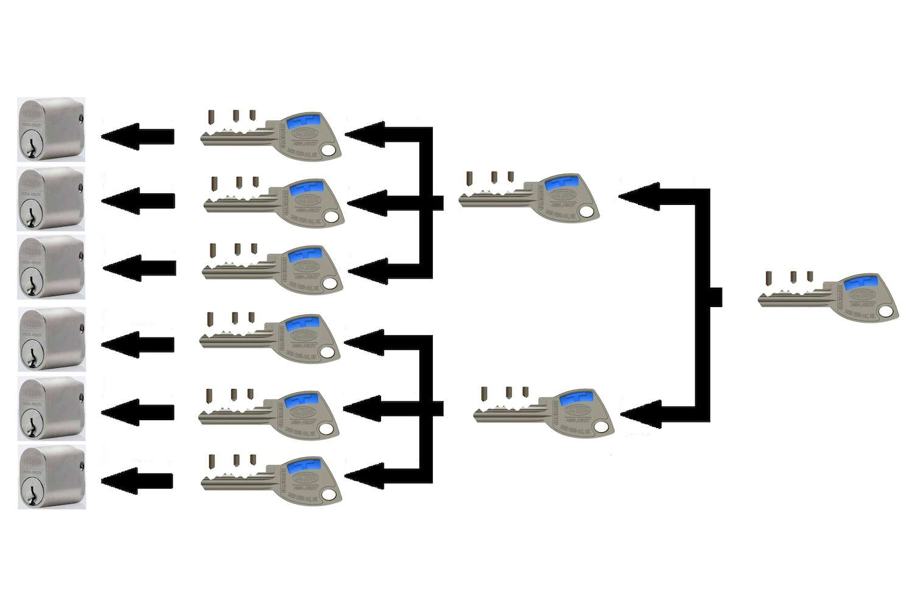

# The Master Key - A Teaching Story

[Home](../../index.md)

I generally took teaching seriously but sometimes I kind of played around and funny shit happened. The names in this story are fake for reasons that will become obvious. I can't remember some of the details so this might not be totally accurate. Anyway this is what happened.

When I was a Maths/Physics teacher I became good friends with the woodwork teacher. Ben had (and still has) a wicked sense of humor. He was a very mischievous person. He could be a professional, but I could tell he didn't like putting on a professional front. I think we were similar like that, but I was a little more reserved. We both disliked rules that got in our way. That underlying angst of annoying rules is what probably got us into some deep shit one day.

Schools don't trust teachers. Okay, they're trusted slightly more than the students, but not by much. Teachers were assigned keys to specific areas of the school, only opening the areas they used on a regular basis. If we wanted access to a different room (which was common), we had to go to the business manager and sign to borrow the master key. This was really annoying, especially when our days were super compressed and we were struggling for time. We weren't going to steal shit from the school if we had access to everything! Ben and I felt like we should have master keys and be done with it.

One day Ben saw an opportunity to dodge that whole process, and he took it. The master key was left unguarded during some building works on the school. It was just laying around in the front office. Ben saw the key, and immediately decided to steal it! He told me about it, and I thought it was hilarious. It was a happy day. Ben made me promise not to tell anyone, it had to be our secret key. Only we could know about it, and use it. He put all this polymer putty on the key's head to disguise the fact that it was the master key. I thought it was all really cool. It really did make life a lot easier for Ben, and I borrowed it off him whenever.

One day, months later, I was called to the front office over the loud speakers. The business manager (Margaret) looked super unhappy with me.  She held up the puttied master key and asked me if I'd seen it before. She said this in an angry, accusing sort of way. I was a bit worried but kept my cool. I knew I didn't steal it. I said "Yeah, it's the master key". Then she asked me why I had it. At this point I was confused. I didn't have the master key, Ben did, and I had no idea how Margaret was back in possession of it. I knew something had gone very wrong, but I couldn't understand how I was being accused of stealing the key. Margaret was a bulldog, detective type. I knew she had to get to the bottom of it. I suppose it was her responsibility to not leave that key lying around, so she would have got some heat from the principal for losing it. That would have made her even more upset at the person that stole it. The situation was especially dodgy because the key had this ridiculous putty on it. She definitely thought I had stolen it.

The next thing Margaret told me shocked me. She told me that Ben had the key, and when she asked Ben where he got it from, he told her that he got it from me! After I heard that, my blood pressure felt like it went through the roof. All I knew for sure was that I needed to stay calm. But inside I was angry at Ben. I could imagine what happened; he got caught, freaked about the possibility of losing his job and in a moment of panic, he said he got it from me.
 
Margaret asked me a bunch of questions. I kept a calm exterior and said I didn't have a clue what Ben was talking about. I just kept denying any knowledge of the situation. I figured I'd have to talk to Ben about it later. For a split second I considered telling her Ben took it during the building works, but I decided to play ignorant until after I cooled off and talked to Ben. It was very disappointing to think that Ben would fold so easily. It made me think about how real our friendship was. I would never do that to him. I had his back 100% and I thought it was mutual. For a few minutes I actually felt quite down about not being able to find loyalty in people. Damn humans.

After I left the office, I immediately messaged Ben and asked him to meet me. He came to my maths room. I told him what happened then I asked him the obvious questions. His responses really surprised me. What actually happened was this; he lent the key to a student to go fetch him something from a storage room. Another teacher was suspicious of the kid and took the key off him. The key had all this putty on it to disguise it. It must have looked like the kid stole the key and disguised it. The key was taken to the front office where the 'one key to rule them all' was reunited with the key bearer, Gollum... I mean Margaret. Margaret talked to Ben about it before me. Ben never threw me under the bus. He actually told Margaret that he got the key from Mr Whills, who was the previous woodwork teacher. Mr Whills was an old man that retired the year before. Whills clearly had major issues remembering things. He went a little nutty and married this really young Thai girl after he retired. The point is that it was safe for Ben to blame anything on him. The school wouldn't chase it up with him. Ben told Margaret he found it in Mr Whills' toolbox, with the putty on it already. His explanation was that he innocently happened by the key, and simply started using it. This is where things get interesting... The thing Ben and I didn't know at this point was that when Ben told Margaret he got the key off "Mr Whills" she actually heard "Mr Whittle". Our names sounded very similar, and Whills was retired so it makes sense that 'Whittle' was fresher in Margaret's mind, so that's what she heard, and that's how she thought I stole the key.

We knew we were in deep shit. After panicking, we calmed down and became pragmatic. Ben and I concluded that Margaret had come up with an elaborate plan to pit us against each other, to get me to dob on Ben. We immediately started to devise a plan to counter her plan. We wrote this very professional email from me to Margaret. I cc'd the principal as well. In the email I made it clear that I knew nothing of the key. On top of that I explained that I was extremely upset that my friend and colleague, Ben, had made up lies about me. Our plan was to send the email to Margaret, then Ben would confront her about lying to me about his explanation. I hit send on the email, and Ben went down to her office.

When Ben came back, he explained what had unfolded. Margaret read my email, then, with perfect timing, Ben walked into her office. He explained to me that Margaret thought he said "Mr Whittle" not "Mr Willis". He said she felt really bad about accusing me of stealing the key, and for making me hate Ben. In her mind she had destroyed a friendship and accused the new Maths teacher of stealing for no good reason. It may have looked even worse considering I was the only brown dude in that whole country town. We thought this was the funniest thing in the history of the whole universe! We were both literally crying from laughter. Then, a few seconds later I got an apology email from Margaret. This took the humor of the situation to a level I'd never experienced before. I was struggling to breathe from laughing so hard. Honestly, I was really struggling to breathe from laughter. This went on for quite a while.

Margaret wanted to apologise in person, so with great difficulty, I composed myself and went down there. I was really nice to her. I was like, "Don't worry about it at all, it's all good!" She felt better and we kind of laughed about the big misunderstanding of "Mr Whittle" sounding like "Mr Whills". Ah, that bloody Mr Whills.

Fortunately, the tense situation for Margaret seemed to kill off her detective drive to figure out how the master key really got into Ben's possession. She accepted the Mr Whills story. Ben got zero questioning about that key from there on in, and neither did I. We were back to the old process for using the master key though. That sucked. Our next plan was to make a copy of the key using putty as a mould, then pour super heated liquid metal into mould to forge a new key. Fortunately, we never got around to doing that.

That putty stuff was really interesting. It was super tough and hard after it set. They tried for ages to get it off the key, but couldn't do it. The other Teachers didn't know why the key had all that ridiculous putty on its head. I remember another teacher making a comment about putty on the master key, I said nothing. It made me laugh inside. 